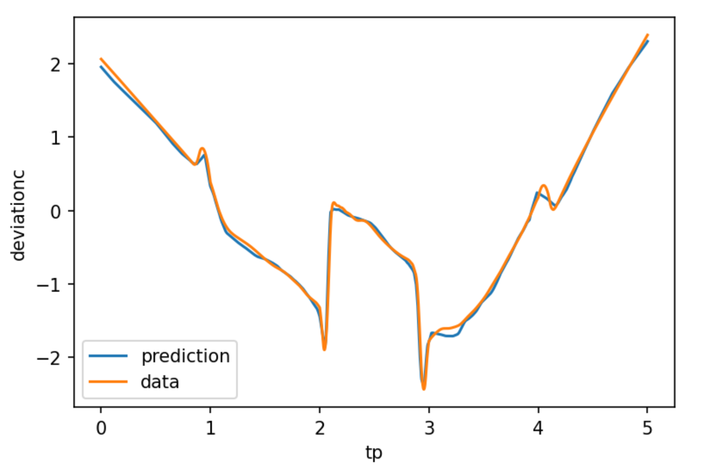

# Data preparation

The data should be passed to the CutPredictor as `pandas` data frames. Each experiment (or simulation) with a unique ID 'doe_id' consists of:

* A set of $d$ process parameters defining the experiment (definition of the material, force applied, etc).
* 1D, 2D or 3D positions in the corresponding space.
* The resulting output variables (such as a deviation) for each position.

The goal is for example to learn to predict the deviation for any position, given a set of (new) process parameters.

Taking the example of the x0 cut in the `Cut_x0.ipynb` notebook, the process parameters may be:

* Blechdicke
* Niederhalterkraft
* Ziehspalt
* Einlegeposition
* Ziehtiefe
* Stempel_ID


the 1D position is `tp` and the only value to predict is `deviationc`. 



Two data frames should be prepared:

1. A `doe` data frame for the $d$ process parameters, including a unique ID per experiment.
2. A `data` data frame for the positions and outputs, with a unique experiment ID for each sample.

The `doe` data frame should look like:

| doe_id     | Blechdicke | Kraft             | Ziehspalt | Position        | Ziehtiefe |
|------------|------------|-------------------|-----------|-----------------|-----------|
| 1          | 1.01       | 410.0             | 2.4       | -5              | 30        |
| 2          | 1.48       | 400.0             | 2.4       | -4              | 30        |
| 3          | 1.00       | 210.0             | 2.4       | -1              | 30        | 
|    ...     |    ...     |         ...       |     ...   |      ...        |     ...   |

The `data` data frame should look like:

| doe_id     | tp         | deviationc |
|------------|------------|------------|
| 1          | 0.00       | 1.43       |
| 1          | 0.01       | 1.45       |
| 1          | 0.02       | 1.47       | 
|    ...     |    ...     |   ...      |

Additional columns are not a problem. The name of the column for the experiment ID (here `doe_id`) should be the same in both data frames.

Once the data is prepared in that format and saved to disk (csv, hdf5...), the data frames can be loaded:

```python
doe = pd.read_csv('doe.csv')
data = pd.read_csv('data.csv')
```